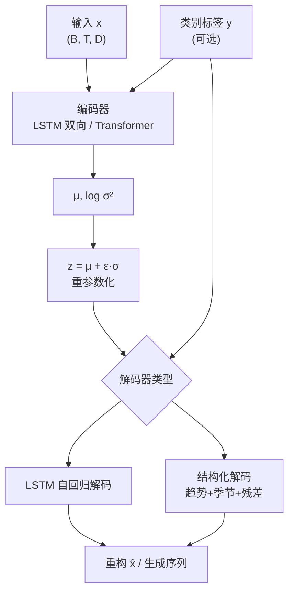

# TVAE 算法结构与原理

本文档总结 `data_aug/tvae.py` 中 **T-VAE（Transformer-based Variational Autoencoder）** 的模型结构、训练策略与数据增强流程。主配置使用自注意力编码与结构化解码；可选 LSTM 编码/解码用于兼容早期单变量实验。实现源自 `TVAE.ipynb`（原 RVAE  notebook），用于对时序/滑窗信号进行无监督或条件生成式数据增强。

---

## 1. 总体定位

TVAE 是一种面向**固定长度时序窗口**的变分自编码器（VAE）：

| 维度 | 说明 |
|------|------|
| 输入 | `(batch, seq_len, input_dim)`，特征已归一化到 `[-1, 1]` |
| 潜变量 | `z ∈ ℝ^{latent_dim}`，经重参数化采样 |
| 输出 | 同形状的重构序列，或从 `z ~ N(0,I)` 采样的新序列 |
| 用途 | 训练后生成与原始分布相近的合成窗口，供下游故障诊断等任务扩增样本 |

与标准 VAE 的主要区别：

- **编码器**可选双向 LSTM 或 Transformer，专门建模时间依赖；
- **解码器**可选自回归 LSTM，或**结构化解码器**（趋势 + 季节 + 残差 + 异方差噪声）；
- **训练**采用 Teacher Forcing 退火、KL 权重调度、开环辅助损失等时序 VAE 常见技巧。

---

## 2. 数据流与预处理

```
原始数据 (1D / 2D / 3D)
    ↓ min-max 归一化 → [-1, 1]
    ↓ 滑窗 (seq_len, stride)
sequences: (N, seq_len, input_dim)
    ↓ DataLoader
训练 / 生成 / 评估
```

`_prepare_data()` 根据 `raw_data` 维度处理：

- **3D**：已是窗口形式，按 `(样本, 时间, 特征)` 逐维 min-max；
- **2D**：按 `stride` 滑窗切片；
- **1D**：`normalize_to_minus1_1` + `create_sequences`。

若 `bundle.labels` 存在且 `conditional: true`，每个窗口附带类别标签，用于条件嵌入。

---

## 3. 模型架构总览



符号：`B` batch，`T = seq_len`，`D = input_dim`。

---

## 4. 编码器（Encoder）

### 4.1 条件输入拼接

当 `num_classes > 0` 且 `label_embed_dim > 0` 时启用**条件 TVAE**：

```text
enc_in = concat(x, label_embedding(y) 沿时间维广播)
```

类别通过 `nn.Embedding` 映射为 `label_embed_dim` 维向量，在每个时间步与特征拼接。

### 4.2 模式 A：双向 LSTM（默认）

```text
encoder_lstm: LSTM(enc_in_dim → hidden_dim, bidirectional=True)
context = concat(h_forward, h_backward)   # 最后一层双向隐状态
μ  = fc_mu(context)
logvar = fc_logvar(context)
```

将整个序列压缩为**单个上下文向量**，再映射到潜空间参数。适合较短序列、计算开销较低的场景（如 `tvae_cooler.yaml`）。

### 4.3 模式 B：Transformer 编码器

`use_attention_encoder: true` 时：

1. `Linear` 投影到 `hidden_dim`；
2. 加**正弦位置编码**（与原始 Transformer 相同公式）；
3. `TransformerEncoder`（`norm_first=True`，`GELU`）；
4. 将 `(B, T, hidden_dim)` 展平为 `(B, T·hidden_dim)`，再经 `fc_mu` / `fc_logvar`。

适合多特征、较长窗口、需要全局时间依赖的场景（如 `tvae_sensitivity.yaml`）。

### 4.4 重参数化

```python
z = μ + ε * exp(0.5 * logvar),  ε ~ N(0, I)
```

标准 VAE 技巧，使采样可导。

---

## 5. 解码器（Decoder）

解码器二选一，由 `structured_decoder` 配置决定。

### 5.1 模式 A：LSTM 自回归解码（经典 TVAE）

**训练（Teacher Forcing）**：逐步输入真实 `x_t`，以概率 `teacher_force_ratio` 决定下一步用真值还是模型预测。

**推理 / 生成**：

- `first_inputs`：用真实窗口首帧或零向量启动；
- 每步输入 `concat(x_t, z, label_ctx)`，LSTM 输出下一帧；
- 自回归滚动 `seq_len` 步。

`dec_dropout` 在训练时对解码器输入做 dropout，减轻 exposure bias。

### 5.2 模式 B：结构化解码器（Structured Decoder）

一次性由 `z`（及标签上下文）生成整段序列，分解为：

```text
x̂ = tanh( trend + seasonal + residual ) + optional_noise
```

| 分量 | 机制 |
|------|------|
| **趋势 trend** | 从 `z` 预测每特征的多项式系数（阶数 `trend_degree`），与预计算时间基 `t^0, t^1, …` 做矩阵乘 |
| **季节 seasonal** | 对 `seasonal_periods` 中每个周期 P，预计算 `sin(2πt/P)`、`cos(2πt/P)` 基；系数由 `seasonal_head` 预测 |
| **残差 residual** | MLP 输出 `(T, D)`，再经 `Conv1d` 残差细化（局部时序平滑） |
| **不确定性** | `logvar_head` 输出逐点 log 方差，训练/采样时加高斯噪声 |

输出经 `tanh` 约束在合理范围；采样时 `clamp(mean + noise, -1.2, 1.2)`。

**特点**：非自回归、可并行、显式建模低频趋势与周期性，适合退化指标等具有周期/漂移特性的多变量序列。

---

## 6. 损失函数

总损失：

```text
L = L_recon + β · L_KL + w_ol · L_openloop
```

### 6.1 重构损失

- **LSTM 解码器**：`MSE(recon_x, x)`；
- **结构化解码器**：高斯负对数似然（异方差）：

```text
L_recon = 0.5 * mean( (x - μ_dec)² / exp(logvar_dec) + logvar_dec )
```

其中 `μ_dec`、`logvar_dec` 由 `_decode_structured` 缓存到 `model.decoder_mean` / `model.decoder_logvar`。

### 6.2 KL 散度

标准各向同性先验：

```text
L_KL = -0.5 * mean( 1 + logvar - μ² - exp(logvar) )
```

可选 `free_bits`：对 KL 做下界截断，缓解 posterior collapse。

### 6.3 开环辅助损失（仅 LSTM 解码器）

当 `epoch > phase1_tf_epochs` 且 `openloop_aux_weight > 0`：

```text
L_ol = MSE( decode(μ, first_inputs=x[:,0:1]), x )
```

用确定性潜变量 `μ` 做纯自回归重构，减轻 Teacher Forcing 与推理分布的差异。

---

## 7. 训练策略

训练循环在 `train()` 中实现，核心调度如下。

### 7.1 Teacher Forcing 比率 (TFR)

| 阶段 | TFR |
|------|-----|
| `epoch ≤ phase1_tf_epochs` | 1.0（完全真值输入） |
| 之后 `ramp_tfr_epochs` 内线性下降 | → `tfr_min` |

结构化解码器不使用 TFR（非自回归）。

### 7.2 KL 权重 β

两种调度（`use_reference_kl_schedule`）：

1. **参考调度（默认）**：前 `beta_delay_frac × total_steps` 步 `β=0`；之后用 `reference_kld_scale`（双曲正切型 S 曲线）从 0 升至 `beta_end`；
2. **线性 warmup**：按 epoch 在 phase1 后线性增至 `beta_end`。

延迟 KL 有助于前期专注重构，避免潜空间过早坍缩。

### 7.3 其他

- **优化器**：Adam + `weight_decay`；
- **学习率**：`ReduceLROnPlateau` 监控 `recon_loss`；
- **梯度裁剪**：`max_norm=1.0`；
- **最佳模型**：按训练集 `recon_loss` 保存 `checkpoint_best.pth`。

---

## 8. 生成与评估

### 8.1 生成 `generate()`

1. 从 `N(0,I)` 采样 `z`；
2. **条件模式**：按类别分别生成，标签固定为 `label_id`；
3. **启动策略** `use_data_start`：
   - `true`：从训练集随机取真实首帧 `x[:,0:1]` 作为 `first_inputs`（LSTM）；
   - `false`：零初始化或纯结构化解码；
4. 反归一化保存 `generated_samples_denorm.npy`。

### 8.2 评估 `evaluate()` / `validate_and_visualize()`

| 输出 | 内容 |
|------|------|
| `signal_comparison.png` | 原始 vs 生成波形对比 |
| `frequency_comparison.png` | 拼接序列的 FFT 频谱对比 |
| `metrics.json` | 均值/方差/相关系数、Teacher Forcing vs 开环 MSE |
| 按类指标 | 条件模型下每类单独统计 |

诊断指标：

- `mse_teacher_forced`：训练式重构误差；
- `mse_open_loop`：确定性 `μ` + 自回归推理误差。

---

## 9. 模块与 API 对照

| 符号 / 函数 | 职责 |
|-------------|------|
| `TVAE` | 主网络：`encode` / `decode` / `forward` / `generate` |
| `loss_function` | 简单 MSE + KL（遗留接口） |
| `reconstruction_loss` | 训练用重构项（支持结构化 NLL） |
| `reference_kld_scale` | KL 权重 S 曲线 |
| `_prepare_data` | 归一化、滑窗、DataLoader |
| `train` | 完整训练循环与 checkpoint |
| `load_checkpoint` | 从配置 + checkpoint 恢复模型 |
| `generate` | 批量合成样本 |
| `evaluate` | 可视化与指标落盘 |

统一入口：`python data_aug/train.py --config ... --stage {train|generate|evaluate|all}`，`model.name: tvae`。

---

## 10. 关键超参数

| 参数 | 典型值 | 含义 |
|------|--------|------|
| `seq_len` | 96 / 128 | 窗口长度 |
| `input_dim` | 1 / 7 | 每步特征维数 |
| `latent_dim` | 32 | 潜空间维度 |
| `hidden_dim` | 128 | 隐层宽度 |
| `use_attention_encoder` | false / true | LSTM vs Transformer 编码 |
| `structured_decoder` | false / true | LSTM 自回归 vs 趋势-季节-残差 |
| `seasonal_periods` | [4,8,16,32] | 季节基周期（结构化解码） |
| `conditional` + `label_embed_dim` | — | 按故障类别条件生成 |
| `phase1_tf_epochs` | 0~40 | 全 Teacher Forcing 阶段 |
| `beta_end` | 0.04 | KL 权重上限 |
| `openloop_aux_weight` | 0~0.25 | 开环辅助（LSTM 专用） |

---

## 11. 两种配置范式对比

| 场景 | 编码器 | 解码器 | TFR / 开环 | 示例配置 |
|------|--------|--------|------------|----------|
| 单变量冷却曲线 | 双向 LSTM | LSTM 自回归 | 长 phase1 + 开环辅助 | `tvae_cooler.yaml` |
| 多特征灵敏度退化 | Transformer | 结构化 + 季节项 | TFR≈0，无开环 | `tvae_sensitivity.yaml` |

---

## 12. 设计要点小结

1. **VAE 框架**保证潜空间连续、可采样，适合生成多样化增强样本；
2. **时序编码**（LSTM/Transformer）捕获窗口内动态，而非把整窗当作独立向量；
3. **结构化解码**将物理直觉（趋势、周期、残差）注入生成路径，并配合异方差 NLL；
4. **条件嵌入**使多类别退化数据可按类生成，避免模式混淆；
5. **分阶段训练**（KL 延迟、TFR 退火、开环正则）缓解 seq2seq VAE 常见的重构-正则权衡与 exposure bias。

---

## 参考

- 实现文件：[`data_aug/tvae.py`](tvae.py)
- 运行说明：[`data_aug/README.md`](README.md)
- 配置示例：`configs/data_aug/tvae_cooler.yaml`、`configs/data_aug/tvae_sifuqi.yaml`
