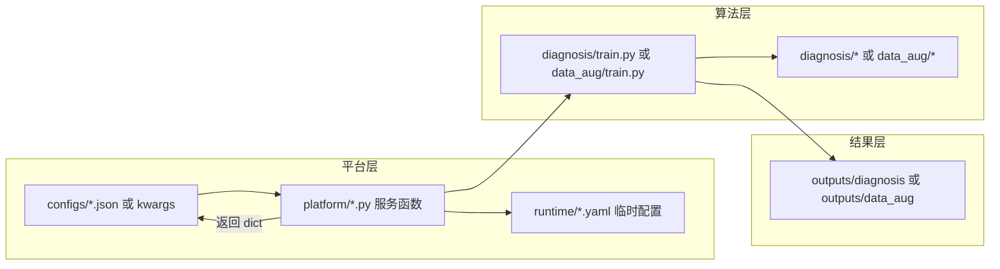

# 平台封装说明（总览）

版本：V1.1  
适用环境：Python 3.7.6（见 `requirements-py37.txt`）

本文档面向**组装平台的同事**，说明本仓库中「算法实现」与「平台服务封装」的关系，以及如何对接四个对外脚本。

---

## 1. 三层结构

```
aug_diagnosis/
├── diagnosis/          ← 故障诊断算法实现（CNN-BiGRU / ResNet / TL-Meta）
├── data_aug/           ← 数据增强算法实现（GAN / TVAE / GAN-VAE）
├── data/               ← 原始训练数据（CSV）
├── outputs/            ← ★ 正式实验结果（已训练好的模型，交付用）
└── platform/           ← ★ 平台封装层（你们对接的入口）
    ├── fault_diagnosis_train.py
    ├── fault_diagnosis_test.py
    ├── data_augmentation_train.py
    ├── data_augmentation_generate.py
    ├── platform_common.py / config.py
    ├── configs/        ← InterfaceType=input JSON 模板
    └── demo_data/      ← 小数据子集，仅用于联调
```

| 层级 | 目录 | 职责 | 是否交付模型 |
|------|------|------|-------------|
| 算法层 | `diagnosis/`、`data_aug/` | 训练、推理、生成核心逻辑 | 否（源码） |
| 平台层 | `platform/` | 解析 JSON/kwargs → 生成 YAML → 调用算法层 → 返回 dict | 否（接口代码） |
| 结果层 | `outputs/` | 完整训练产出的 checkpoint、指标、图表 | **是** |

**要点：平台脚本本身不保存「最终交付模型」；正式模型在 `outputs/` 下。测试/生成接口的 `run_dir` 必须指向 `outputs/` 里的实验目录。**

---

## 2. 调用链路



**训练流程**：平台脚本 → 写 YAML → 调用 `diagnosis/train.py` 或 `data_aug/train.py` → 结果写入 `outputs/...`

**测试/生成流程**：平台脚本读取 `run_dir`（`outputs/` 下已有目录）→ 加载 `config_resolved.yaml` + `checkpoint_best.pth` → 评估或生成

---

## 3. 四个对外服务

| 脚本 | 函数名 | 用途 | 详细文档 |
|------|--------|------|----------|
| `fault_diagnosis_train.py` | `fault_diagnosis_train` | 训练诊断模型 | [故障诊断算法接口说明.md](故障诊断算法接口说明.md) |
| `fault_diagnosis_test.py` | `fault_diagnosis_test` | 测试已训练模型 | 同上 |
| `data_augmentation_train.py` | `data_augmentation_train` | 训练增强模型 | [数据增强算法接口说明.md](数据增强算法接口说明.md) |
| `data_augmentation_generate.py` | `data_augmentation_generate` | 生成增强样本 | 同上 |

接口规范（《光电算法规范》）：

- 脚本文件名 = 函数名
- 函数支持 `**kwargs`
- 返回英文键名的 `dict`；可选写出 `InterfaceType=output` JSON

---

## 4. run_dir 与 outputs/（重要）

测试（`fault_diagnosis_test`）和生成（`data_augmentation_generate`）需要传入 **`run_dir`**，指向一次完整训练产生的目录。

### 4.1 目录必须满足

```
outputs/diagnosis/{dataset}/{model}/{experiment_name}/
├── checkpoint_best.pth      # 必需
├── config_resolved.yaml       # 必需
├── test_metrics.json          # 测试后产生
└── confusion_matrix.png       # 测试后产生
```

示例（灵敏度 CNN-BiGRU）：

```
outputs/diagnosis/sensitivity/cnn_bigru/cnn_bigru_sensitivity_v1_20260526_152138
```

### 4.2 不要使用

- `platform/runtime/` — 临时 YAML，可删
- 冒烟训练产生的低质量结果 — `smoke=true` 仅 2 epoch，仅供联调

### 4.3 配置方式

编辑 `configs/fault_diagnosis_test_input.json`：

```json
{
  "english_name": "run_dir",
  "param_value": "outputs/diagnosis/sensitivity/cnn_bigru/cnn_bigru_sensitivity_v1_20260526_152138"
}
```

路径相对于**项目根目录** `aug_diagnosis/`（在仓库根目录执行脚本）。

---

## 5. 环境与安装

```bash
cd /path/to/aug_diagnosis
conda create -n py376 python=3.7.6 -y
conda activate py376
pip install torch==1.13.1+cpu torchvision==0.14.1+cpu -f https://download.pytorch.org/whl/torch_stable.html
pip install -r platform/requirements-py37.txt
```

---

## 6. 快速联调（推荐顺序）

```bash
# 1. 测试已有正式模型（无需重新训练）
python platform/fault_diagnosis_test.py \
  --config platform/configs/fault_diagnosis_test_input.json

# 2. 可选：冒烟训练（验证训练接口能跑通，smoke=true 仅 2 epoch）
python platform/fault_diagnosis_train.py \
  --config platform/configs/fault_diagnosis_train_input.json

# 3. 数据增强：对 outputs/data_aug/... 下已有目录做生成
python platform/data_augmentation_generate.py \
  --config platform/configs/data_augmentation_generate_input.json
```

---

## 7. 其他交付文档

| 文档 | 位置 | 内容 |
|------|------|------|
| 算法原理说明 | `light/故障诊断算法说明文档.md` | 算法细节、实验结论 |
| 算法统计表格 | `light/算法统计表格.md` | 算法清单与文件列表 |
| 光电算法规范 | `light/光电算法规范.docx` | 甲方接口 JSON 格式 |

---

## 8. platform/ 目录文件说明

| 路径 | 说明 |
|------|------|
| `fault_diagnosis_*.py` | 诊断训练/测试服务入口 |
| `data_augmentation_*.py` | 增强训练/生成服务入口 |
| `platform_common.py` | JSON 解析、路径解析、输出 dict 构建 |
| `config.py` | 数据集 profile、YAML 配置生成 |
| `configs/` | 四个服务的输入 JSON 模板 |
| `demo_data/` | 裁剪演示 CSV（联调用，非正式数据） |
| `runtime/` | 运行时自动生成的 YAML（可删，会自动重建） |
| `requirements-py37.txt` | Py3.7.6 依赖清单 |
